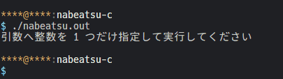

# nabeatsu-c

引数として与えられた整数が 3 で割り切れる または 文字列に 3 を含む場合 `[num]!!!` と出力する。



## コンパイル・実行

```shell
$ gcc nabeatsu.c -o nabeatsu.out
$ ./nabeatsu.out 0
0
$ ./nabeatsu.out 1
1
$ ./nabeatsu.out 2
2
$ ./nabeatsu.out 3
3!!!
$ ./nabeatsu.out 12
12!!!
```

## 参考

- [Fizz Buzz - Wikipedia](https://ja.wikipedia.org/wiki/Fizz_Buzz)
